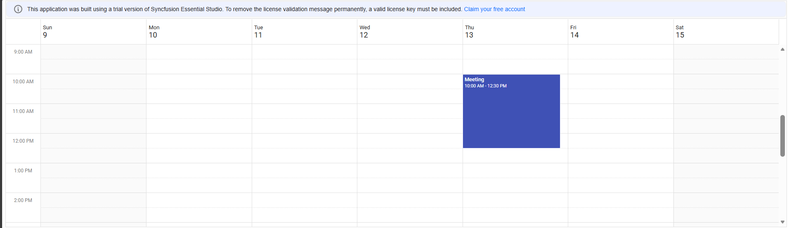

<!--
  howto.md
  A step-by-step guide to integrate Ruby on Rails with Syncfusion TS Scheduler
-->
# How to Integrate Ruby on Rails with Syncfusion Scheduler
This repository contains a sample full-stack application demonstrating how to display events in syncfuison Scheduler component using Ruby on Rails.

## Prerequisites
- Ruby - (3.2.2)
- Node JS - (>=18.13.0)
- Yarn - (>=1.22.19)

## Project Structure
```
├── README.md                  # This guide
├── postcss.config.js
├── package.json                  
├── test       #Testing the functionality      
│   ├── events_controller_test.rb  
│   ├── schedule_controller_test.rb
└── app 
     ├── javascript   #Main JavaScript entry point that initializes frontend behavior
     │   ├── application.js
     │   ├── controllers
     │   │   ├── index.js
     └── views
         ├── layouts
         │   ├── application.html.erb  #Base HTML layout wrapping all views
         └── welcome
             └── index.html.erb  # View template for the welcome page
```

## Project Setup
## Installation
1. ### Clone the project
    Clone the project from the repository by creating a fork and branch.
2. ### Ruby setup
    You can install the Ruby from the following link.
    [`https://www.ruby-lang.org/en/downloads/`](https://www.ruby-lang.org/en/downloads/) 
    Then Install gem using below commands
    ```
    gem install rails
    ```
3. ### Install dependencies:
   	```bash
    npm install
        or
    yarn install
    ```
### Running the Application
1. Navigate to javascript-scheduler-ruby-rails-application folder.
    ```bash
    cd javascript-scheduler-ruby-rails-application
    ```
2. Start the Scheduler Frontend
    ```bash
    rails server
    ```
3. Navigate to `http://localhost:3000` in your browser. (or) Ctrl + click the link in your terminal


## Output


## Troubleshooting
- **Version error**: Check and install the current version as by prerequistes.
- **Port already in use**: Clear all the previous running applications in both browser and command prompt.